# Домашнее задание к занятию 11 «Teamcity». Шелухин Юрий.

## Подготовка к выполнению

1. В Yandex Cloud создайте новый инстанс (4CPU4RAM) на основе образа `jetbrains/teamcity-server`.
2. Дождитесь запуска teamcity, выполните первоначальную настройку.
3. Создайте ещё один инстанс (2CPU4RAM) на основе образа `jetbrains/teamcity-agent`. Пропишите к нему переменную окружения `SERVER_URL: "http://<teamcity_url>:8111"`.
4. Авторизуйте агент.
5. Сделайте fork [репозитория](https://github.com/aragastmatb/example-teamcity).
6. Создайте VM (2CPU4RAM) и запустите [playbook](./infrastructure).

#

В процессе запуска выявил проблемы на сервере:
- контейнер создан, но не запущен;
- порты не были проброшены при создании контейнера;
- проблема с правами доступа к директориям.

Решено следующим образом:  
Заходим по SSH. Удаляем старый контейнер.  
`docker rm teamcity-server`  
Исправляем права на директориях.  
`sudo chown -R 1000:1000 /opt/teamcity/data` 
`sudo chown -R 1000:1000 /opt/teamcity/logs`
Запускаем контейнер без root:
```
docker run -d \
  --name teamcity-server \
  -p 8111:8111 \
  -v /opt/teamcity/data:/data/teamcity_server/datadir \
  -v /opt/teamcity/logs:/opt/teamcity/logs \
  jetbrains/teamcity-server
```


---


## Основная часть
 
1. Создайте новый проект в teamcity на основе fork.

#


2. Сделайте autodetect конфигурации.
3. Сохраните необходимые шаги, запустите первую сборку master.

#


 
4. Поменяйте условия сборки: если сборка по ветке `master`, то должен происходит `mvn clean deploy`, иначе `mvn clean test`.

# 
Поменял условия сборки.


5. Для deploy будет необходимо загрузить [settings.xml](./teamcity/settings.xml) в набор конфигураций maven у teamcity, предварительно записав туда креды для подключения к nexus.

# 
Загрузил конфигурацию


6. В pom.xml необходимо поменять ссылки на репозиторий и nexus.
7. Запустите сборку по master, убедитесь, что всё прошло успешно и артефакт появился в nexus.

#


8. Мигрируйте `build configuration` в репозиторий.

#
Долго настраивал авторизацию, в итоге сделал через токен, созданный на  github.com.

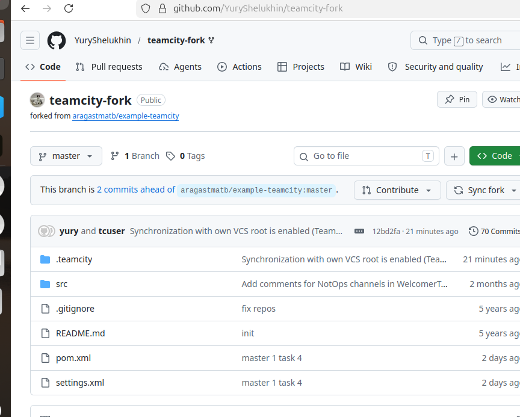


9. Создайте отдельную ветку `feature/add_reply` в репозитории.


#
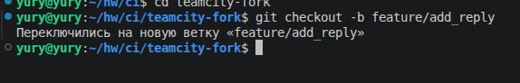

10. Напишите новый метод для класса Welcomer: метод должен возвращать произвольную реплику, содержащую слово `hunter`.

#
<>
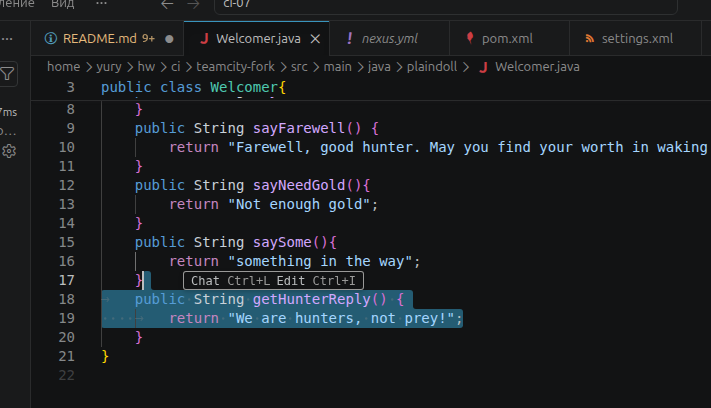

11. Дополните тест для нового метода на поиск слова `hunter` в новой реплике.

#
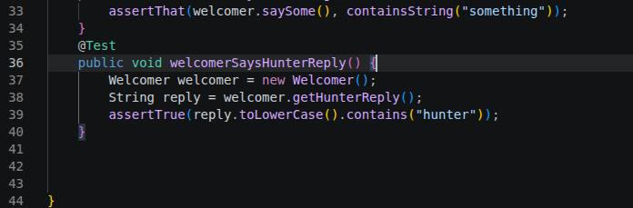

12. Сделайте push всех изменений в новую ветку репозитория.

#
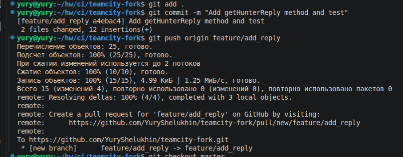
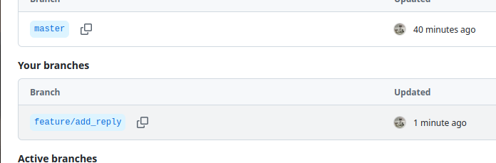

Для запуска сборки для новой ветки перед этим настроил сборку teamcity.

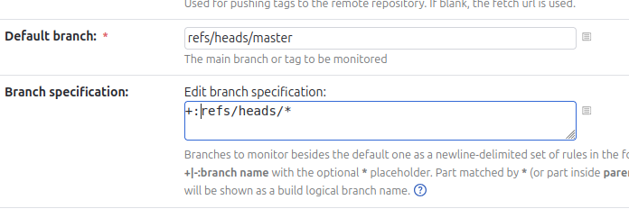
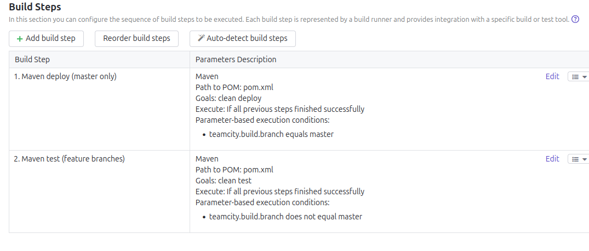
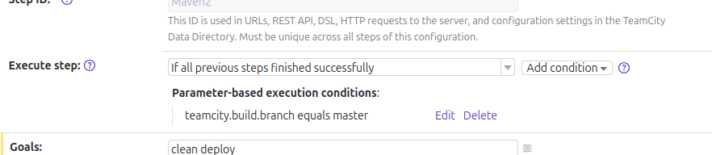


13. Убедитесь, что сборка самостоятельно запустилась, тесты прошли успешно.

#

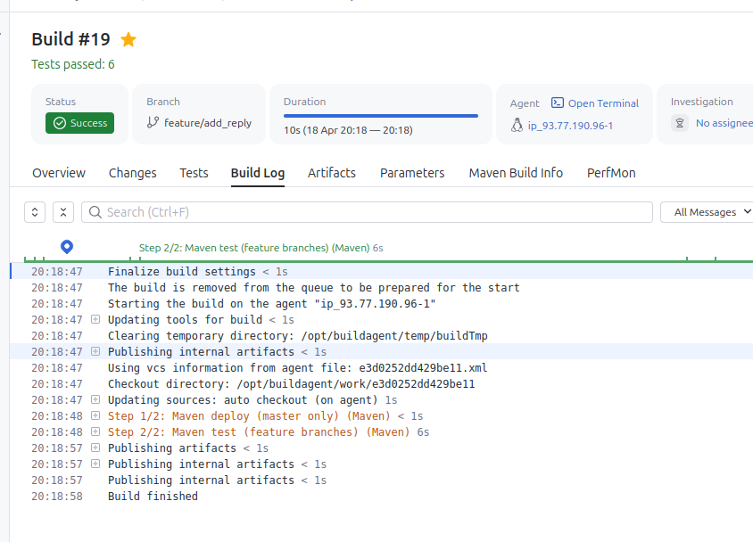


14. Внесите изменения из произвольной ветки `feature/add_reply` в `master` через `Merge`.

#
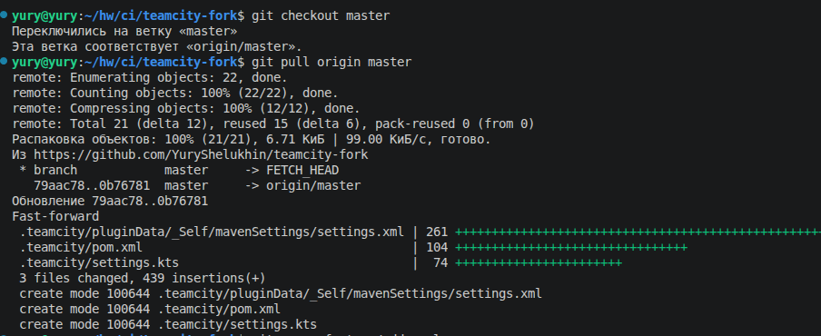
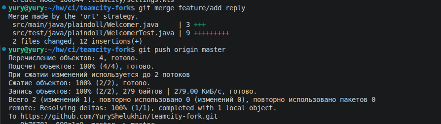

15. Убедитесь, что нет собранного артефакта в сборке по ветке `master`.

#
Запушенный артефакт запустил сборку, которая ожидаемо закончилась  неудачно, так как не была измененена версия.

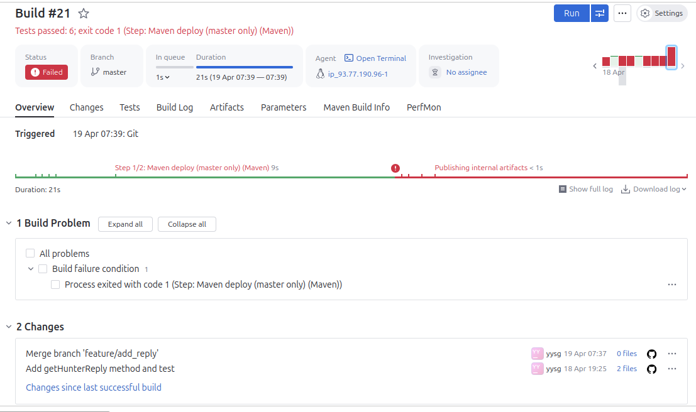


16. Настройте конфигурацию так, чтобы она собирала `.jar` в артефакты сборки.

#
Настроим  конфигурацию  сборки.

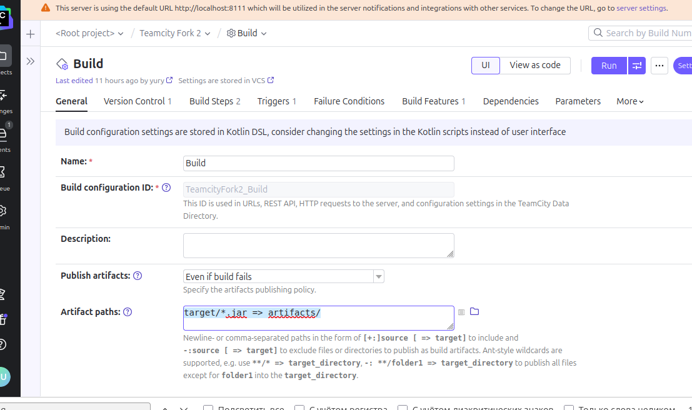

Изменим версию в `pom.xml` на 0.2.0.

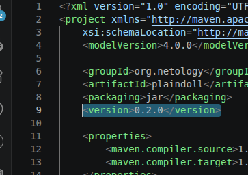

17. Проведите повторную сборку мастера, убедитесь, что сбора прошла успешно и артефакты собраны.

#
Запушенный коммит запустил автоматическую сборку. Был собран артефакт, но сборка была красной.

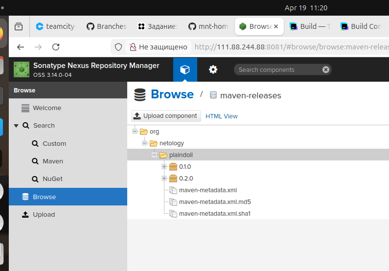
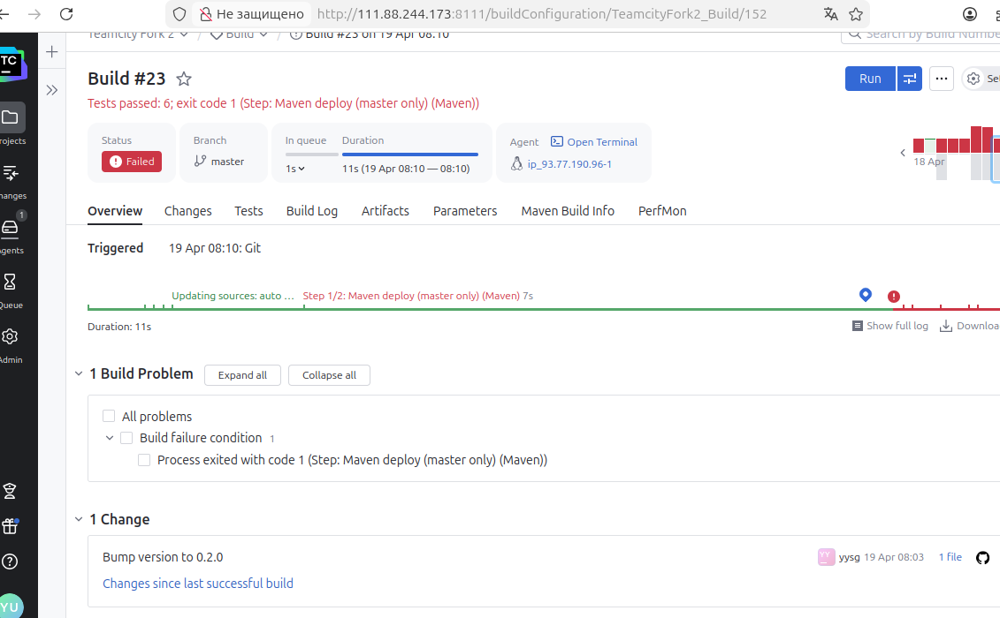

Для того, чтобы сборка проекта прошла успешно и стала "зеленой", потребовалось очистить кэш и запустить сборку с настройкой "delete all files in the checkout directory before the build". Перед этим артефакт был вручную удален.

<image src = "img/1-17-3.png" width = 60%>
<image src = "img/1-17-4.png" width = 60%>


18. Проверьте, что конфигурация в репозитории содержит все настройки конфигурации из teamcity.

#
Проверил  github репозиторий и убедился, что все изменения конфигурации автоматически пушились в .teamcity/.

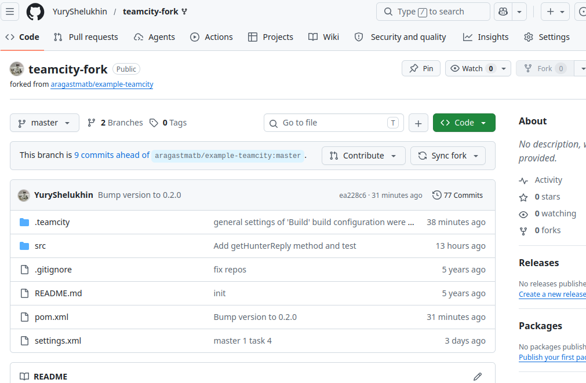
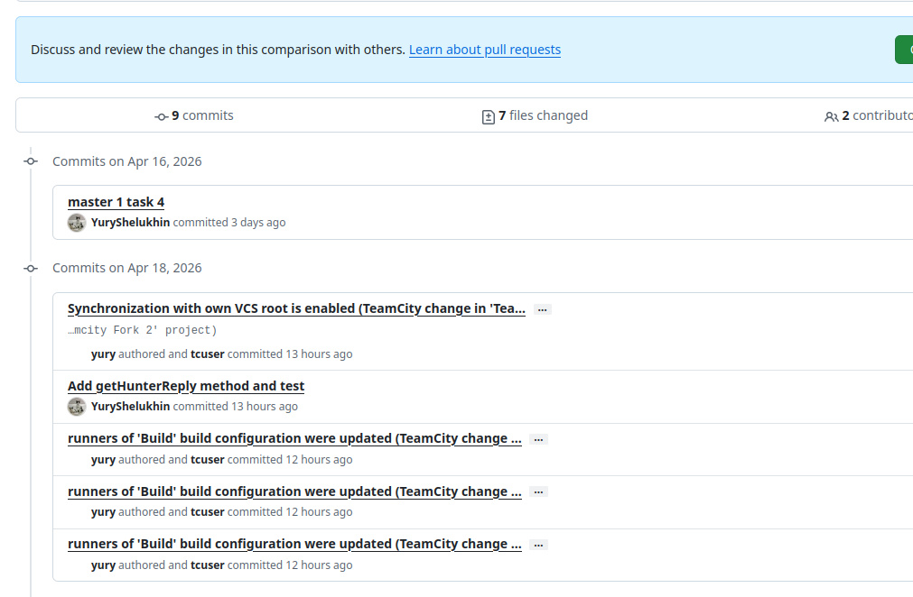
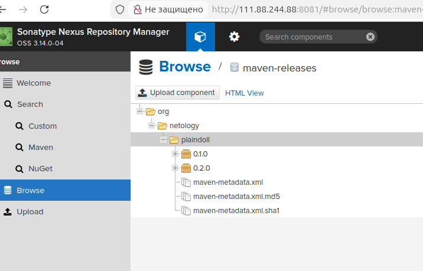

19. В ответе пришлите ссылку на репозиторий.

#
[репозиторий](https://github.com/YuryShelukhin/teamcity-fork)

PS. На скринах видно большое количество красных сборок, которые обусловлены сложностью процесса настроки шагов сборок и условий, веток, которые собиралис, и способа авторизации teamcity в github для сохранения конфигурации.
---
