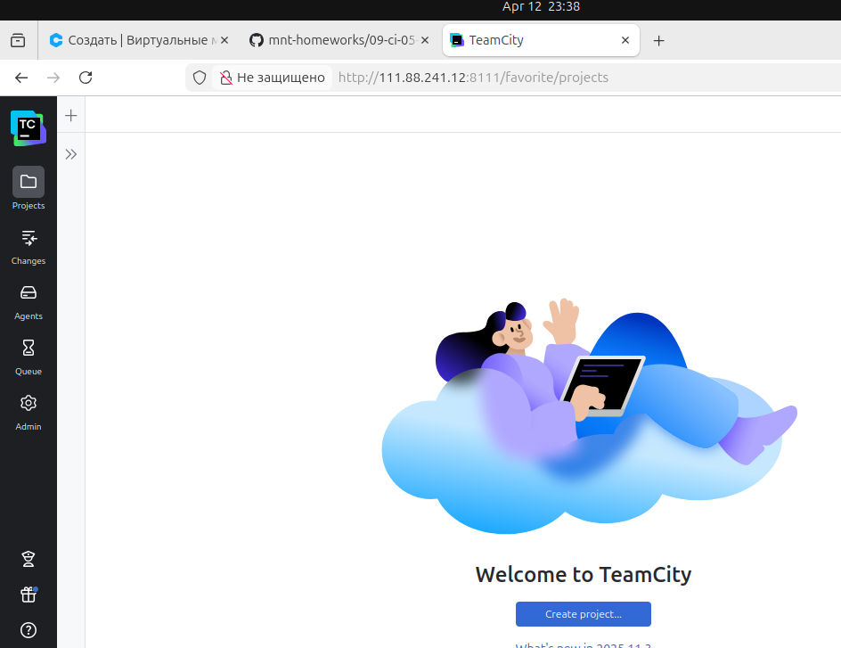
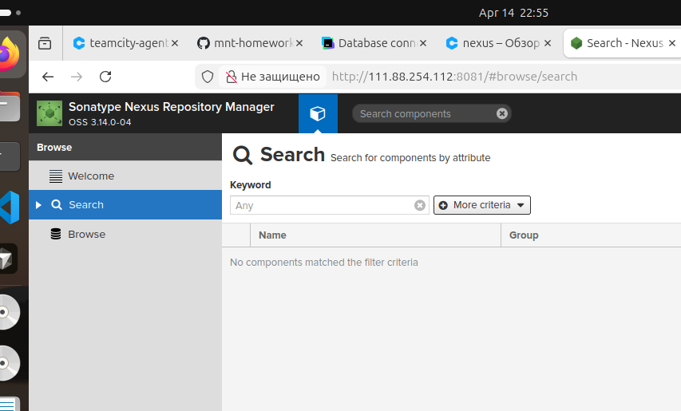
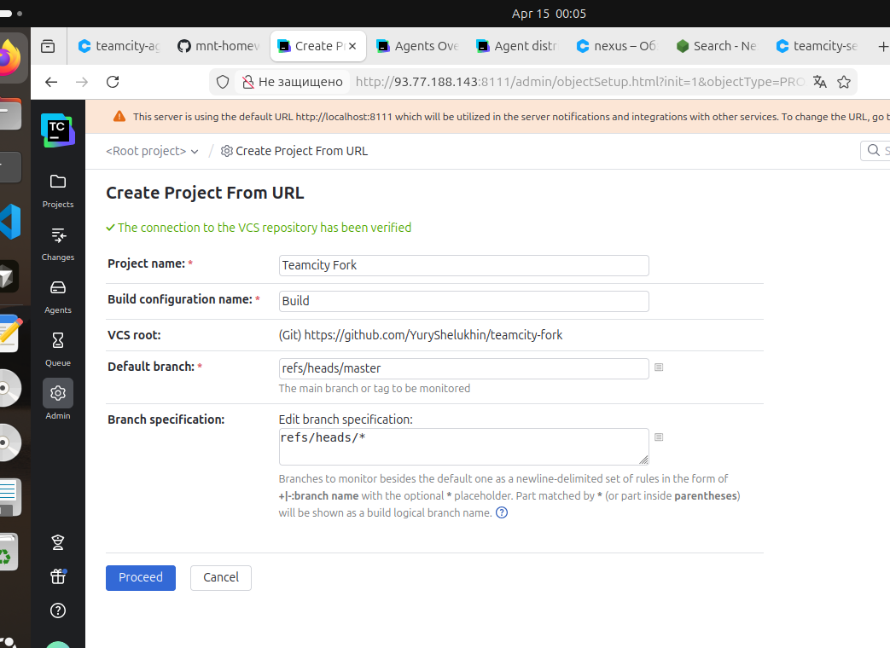
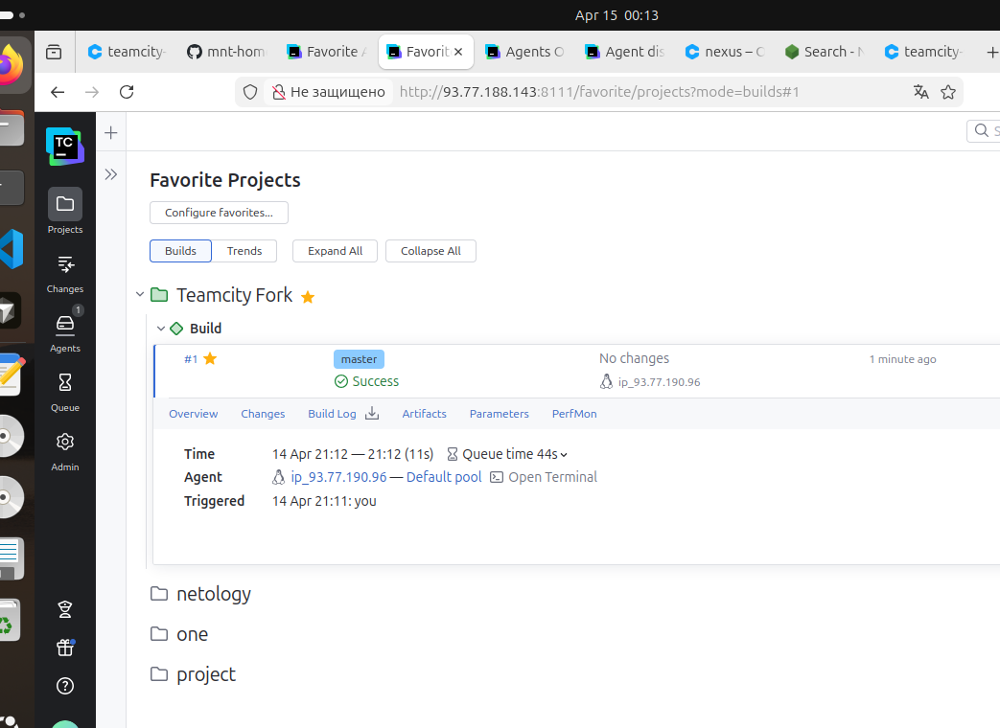
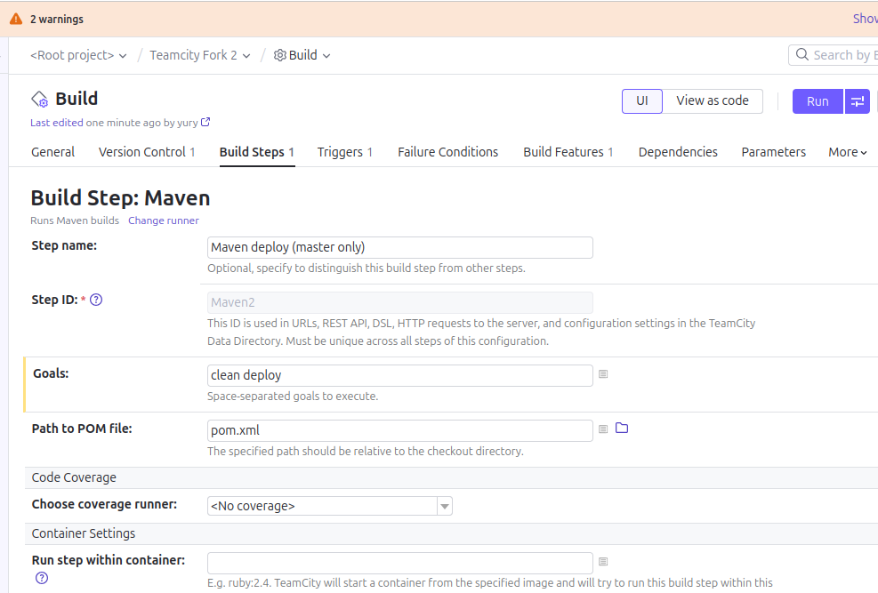
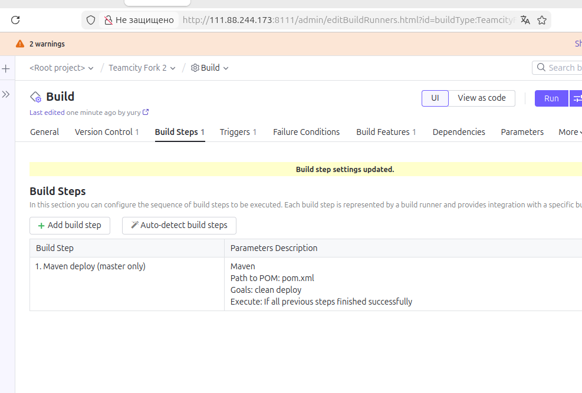
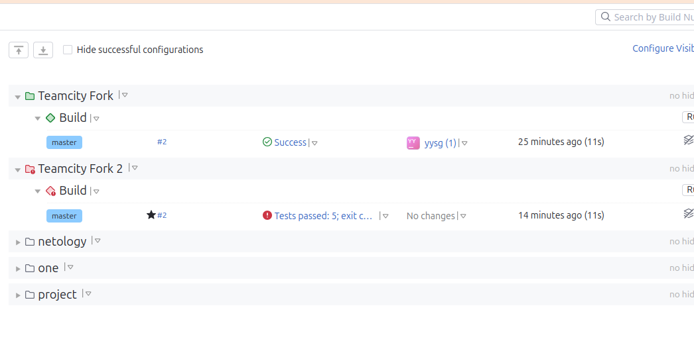

# Домашнее задание к занятию 11 «Teamcity» Шелухин Юрий.

## Подготовка к выполнению

1. В Yandex Cloud создайте новый инстанс (4CPU4RAM) на основе образа `jetbrains/teamcity-server`.
2. Дождитесь запуска teamcity, выполните первоначальную настройку.
3. Создайте ещё один инстанс (2CPU4RAM) на основе образа `jetbrains/teamcity-agent`. Пропишите к нему переменную окружения `SERVER_URL: "http://<teamcity_url>:8111"`.
4. Авторизуйте агент.
5. Сделайте fork [репозитория](https://github.com/aragastmatb/example-teamcity).
6. Создайте VM (2CPU4RAM) и запустите [playbook](./infrastructure).

#

В процессе запуска выявил проблемы на сервере:
- контейнер создан, но не запущен;
- порты не были проброшены при создании контейнера;
- проблема с правами доступа к директориям.

Решено следующим образом:
Заходим по SSH. Удаляем старый контейнер.
`docker rm teamcity-server`
Исправляем права на директориях
`sudo chown -R 1000:1000 /opt/teamcity/data`
`sudo chown -R 1000:1000 /opt/teamcity/logs`
Запускаем контейнер без root:
```
docker run -d \
  --name teamcity-server \
  -p 8111:8111 \
  -v /opt/teamcity/data:/data/teamcity_server/datadir \
  -v /opt/teamcity/logs:/opt/teamcity/logs \
  jetbrains/teamcity-server
```




---

## Основная часть

1. Создайте новый проект в teamcity на основе fork.

#




2. Сделайте autodetect конфигурации.


3. Сохраните необходимые шаги, запустите первую сборку master.

#


 
4. Поменяйте условия сборки: если сборка по ветке `master`, то должен происходит `mvn clean deploy`, иначе `mvn clean test`.

# 
Поменял условия сборки.


5. Для deploy будет необходимо загрузить [settings.xml](./teamcity/settings.xml) в набор конфигураций maven у teamcity, предварительно записав туда креды для подключения к nexus.

# 
Загрузил конфигурацию



6. В pom.xml необходимо поменять ссылки на репозиторий и nexus.
7. Запустите сборку по master, убедитесь, что всё прошло успешно и артефакт появился в nexus.

#
 Прошло с ошибкой



8. Мигрируйте `build configuration` в репозиторий.
9. Создайте отдельную ветку `feature/add_reply` в репозитории.
10. Напишите новый метод для класса Welcomer: метод должен возвращать произвольную реплику, содержащую слово `hunter`.
11. Дополните тест для нового метода на поиск слова `hunter` в новой реплике.
12. Сделайте push всех изменений в новую ветку репозитория.
13. Убедитесь, что сборка самостоятельно запустилась, тесты прошли успешно.
14. Внесите изменения из произвольной ветки `feature/add_reply` в `master` через `Merge`.
15. Убедитесь, что нет собранного артефакта в сборке по ветке `master`.
16. Настройте конфигурацию так, чтобы она собирала `.jar` в артефакты сборки.
17. Проведите повторную сборку мастера, убедитесь, что сбора прошла успешно и артефакты собраны.
18. Проверьте, что конфигурация в репозитории содержит все настройки конфигурации из teamcity.
19. В ответе пришлите ссылку на репозиторий.

---

### Как оформить решение задания

Выполненное домашнее задание пришлите в виде ссылки на .md-файл в вашем репозитории.

---


